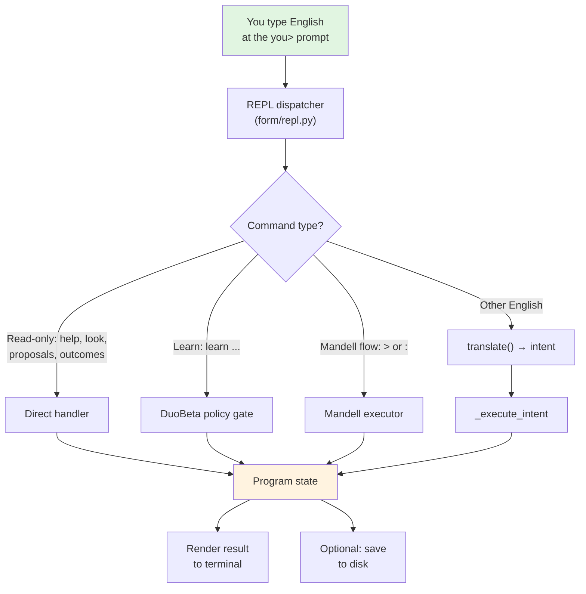
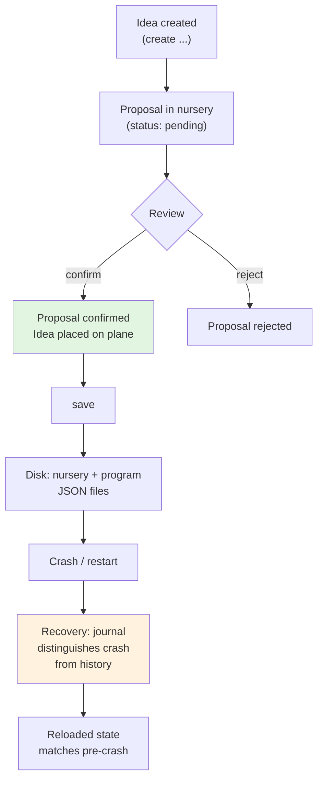

# DellMatrix

**An offline idea environment with a structured language for working with thoughts.**

DellMatrix lets you create ideas, grow them into proposals, confirm the ones worth keeping, inspect how they relate, and save everything to disk — all through plain English commands in a terminal, with no network required.

> **Scope honesty:** This README describes what the code at the reviewed production SHA actually does, based on executed walkthroughs. Section 2 lists exactly what is working, partial, in repair, or planned. Nothing here claims more than the evidence supports.

---

## 1. What DellMatrix Is

**Mandell** is a structured language of operators ("Dells"), flow, and math/nature patterns. It is designed to be readable by people and executable by machines — a bridge language for human-computer collaboration.

**DellMatrix** is the host environment that runs Mandell. It provides:

- **An idea workspace** — create ideas, give them words, detail, and goals
- **A nursery** — grow ideas into proposals, review them, confirm or reject
- **A plane** — confirmed ideas become visible "units" you can inspect spatially
- **Persistence** — save your work to disk, reload it later, recover from crashes
- **Learning hooks** — DuoBeta observation and policy-gated learning
- **Visual export** — generate an offline HTML view of your idea space

**Present runtime vs. planned vision:** Today DellMatrix is a working terminal-based idea environment (see §2). The long-term vision includes nested projects, preserved history across sessions, interchangeable perspectives, and richer visual/UX layers — those are labeled PLANNED in §2 and §7, not described as implemented.

---

## 2. Status

Reviewed production SHA: `f3c9007` (2026-10-04). All claims below were verified by executing the commands on this SHA unless labeled otherwise.

| Area | Status | Evidence |
|------|--------|----------|
| REPL launch (`python launch.py`, `python3 -m form.repl`) | **WORKING / VERIFIED** | Launched, `you>` prompt, EOF exits cleanly |
| Create idea (`create an idea called X`) | **WORKING / VERIFIED** | Idea created with coaching on strength/detail/goals |
| Grow ideas (`grow ideas N`) | **WORKING / VERIFIED** | Proposals generated in nursery |
| Review proposals (`proposals`) | **WORKING / VERIFIED** | Lists pending proposals with IDs |
| Confirm (`confirm <id>`, `confirm all`) | **WORKING / VERIFIED** | Proposal confirmed, Idea placed on plane |
| Inspect (`look`, `page`, `rank`) | **WORKING / VERIFIED** | Affinity-ordered display, lineage shown |
| Shapes (`sphere`, `lattice`) | **WORKING / VERIFIED** | Skin/form change, grid render |
| Save / reload (`save`, `--load`) | **WORKING / VERIFIED** | Files written, state survives restart |
| Visual export (`visual`) | **WORKING / VERIFIED** | Offline HTML file generated (in-browser rendering untested) |
| Tutorial (`tutorial`) | **WORKING / VERIFIED** | Walks the acceptance path |
| Help (`help`, 9 categories) | **WORKING / VERIFIED** | create, knowledge, learn, explain, save, recover, look, dell, system |
| DuoBeta learn (`learn propose/inspect/gate/ledger`) | **WORKING / VERIFIED** | Real policy gating within session |
| Python API (`open_program`, `confirm_proposal`, `persist_rest`, `supersede_proposal`) | **WORKING / VERIFIED** | Direct API calls tested |
| Offline operation | **WORKING / VERIFIED** | No network calls in tested paths; stdlib-only core deps |
| Resonance/harmony scoring | **PARTIAL** | Scoring machinery real (`resonance_rank`, affinity); no direct user command |
| DuoBeta cross-session learning | **PARTIAL** | Works within session; cross-process persistence of staged proposals not observed |
| REPL `supersede` command | **BROKEN** | `supersede idea <id> with <words>` fails on normal flow; Python API works |
| `lineage` by label | **BROKEN** | Requires proposal ID; label lookup fails |
| Confirmation atomicity | **IN REPAIR / UNMERGED** | Active repair on [PR #77](https://github.com/spiritualityhandbook-netizen/DellMatrix/pull/77) (not merged) |
| Nested projects / perspectives | **PLANNED** | Not implemented |
| Rich visual UX | **PLANNED** | HTML export exists; interactive UI planned |
| Windows/Mac launchers | **UNVERIFIED** | `Launch DellMatrix.bat` / `.command` exist but not executed |
| Spanish/French commands | **UNVERIFIED** | Claimed in old docs; not executed this session |

---

## 3. How It Works

### (a) From English input to executed result



**Autonomy note:** Every command above requires you to type it. DellMatrix does not take autonomous actions, schedule work, or modify state without an explicit command. "Human-controlled acceptance" in §7 describes the intended policy; the current enforcement is simply that no code path acts without user input.

### (b) Proposal lifecycle and persistence



The nursery tracks proposal status (`pending` → `confirmed`). The plane holds confirmed Ideas as spatial units. On `save`, both are written to disk. If the process crashes mid-confirmation, an intent journal lets recovery distinguish "crashed confirmation" from "legitimate historical record" — this is the mechanism under active repair in PR #77.

---

## 4. Quick Start

**Requirements:** Python 3.10+, no third-party packages for the core loop (see `requirements.txt`). Tested on Linux; Windows/Mac launchers exist but are unverified.

```bash
# Clone and launch
git clone https://github.com/spiritualityhandbook-netizen/DellMatrix
cd DellMatrix
python launch.py YourName
```

You'll see a banner and a `you>` prompt. Type `tutorial` for a guided walkthrough, or `help` for command categories.

**Offline:** The core loop (create → grow → confirm → inspect → save) makes no network calls. Optional features under `form/llm` may need extras; they are not part of the core loop.

**Generated output:** `save` writes JSON files under `form/state/`. `visual` generates `DellMatrix_UI.html` in the repo root.

---

## 5. Capabilities

| Action | User entrypoint | Observable result | Implementation source | Test |
|--------|----------------|-------------------|----------------------|------|
| Create idea | `create an idea called <name>` | Idea stored; coaching on strength/detail/goals | `form/repl.py`, `form/dell_matrix/` | Walkthrough verified |
| Grow proposals | `grow ideas N` | N proposals in nursery | Dell 13 via `form/grow.py` | Walkthrough verified |
| List proposals | `proposals` | Pending proposals with IDs | `form/dell_matrix/nursery.py` | Walkthrough verified |
| Confirm | `confirm <id>` / `confirm all` | Proposal confirmed; Idea on plane | `form/dell_matrix/confirm_lineage.py` | Walkthrough verified |
| Inspect | `look`, `page`, `rank` | Affinity-ordered idea display | `form/dell_matrix/first_person.py` | Walkthrough verified |
| Lineage | `lineage <proposal-id>` | Ancestry/derivation shown | `form/dell_matrix/lineage.py` | Walkthrough verified (ID only) |
| Shapes | `sphere`, `lattice` | Visual form change + grid | `form/dell_matrix/` spatial | Walkthrough verified |
| Save / reload | `save`, `python3 -m form.repl --load` | JSON files; state survives restart | `form/persist.py`, `form/persist_rest.py` | Walkthrough verified |
| Visual export | `visual` | `DellMatrix_UI.html` generated | REPL `visual` handler | File verified; rendering untested |
| Tutorial | `tutorial` | Guided acceptance path | `form/repl.py` | Walkthrough verified |
| DuoBeta learn | `learn propose/inspect/gate/ledger` | Policy-gated learning within session | `form/duobeta/` | Walkthrough verified |
| Supersede (API) | `supersede_proposal(p, old_id, ...)` | New revision; old marked superseded | `form/mandell/supersession.py` | API verified; REPL command broken |
| Outcomes | `outcomes` | Honest empty ("No outcomes recorded") or list | `form/repl.py` | Walkthrough verified |

> A module's existence is not proof of usable integration. Every row above was verified by actually running the command or API call on SHA `f3c9007`.

---

## 6. Walkthroughs

Each walkthrough was executed on SHA `f3c9007` with a temporary owner; state was cleaned up afterward. REPL sessions used piped stdin.

### 6.1 Create, store, reload

```
you> create an idea called my first thought
# → Idea created. Coaching: add detail: and goals: for strength.

you> save
# → State written to form/state/

# Restart: python3 -m form.repl --owner <name> --load
# → Idea present after reload. VERIFIED.
```

### 6.2 Propose, review, confirm

```
you> grow ideas 3
# → 3 proposals in nursery.

you> proposals
# → Lists: <id1>, <id2>, <id3> (copy an ID)

you> confirm <id1>
# → Proposal confirmed; Idea placed on plane.

you> look
# → Confirmed Idea visible. VERIFIED.
```

**How to obtain proposal IDs:** Run `proposals` first; the output lists IDs. Pass one to `confirm`. `confirm all` confirms everything pending.

### 6.3 Inspect relationships

```
you> lineage <proposal-id>
# → Shows derivation/ancestry for that proposal. VERIFIED (ID required;
#    label lookup does not work — known gap).

you> rank
# → Ideas ordered by affinity. VERIFIED.
```

### 6.4 Resonance / harmony candidates

The scoring machinery (`resonance_rank`, affinity) is real and drives `rank`/`page` ordering. There is **no direct user command** for resonance queries — this is a PARTIAL feature. The Phase-3 proof files (`form/mandell/p3_r3*_proof.py`) are tests, not user features.

```python
# Python API only (not exposed in REPL):
from form.dell_matrix.first_person import resonance_rank
# → Returns scored candidates. Verified present; REPL gap labeled.
```

### 6.5 Supersession and history

Supersession (replacing a confirmed idea with a newer revision) works via the Python API but **not** via the REPL command:

```python
# VERIFIED working (Python API):
from form.open import open_program
from form.mandell.supersession import supersede_proposal
p = open_program("Owner")
new_id = supersede_proposal(p, old_id, words="revised content")
# → Old marked superseded; new revision active; history preserved.
```

```
you> supersede idea <id> with <words>
# → BROKEN in REPL (unknown_predecessor / not_on_plane). Use Python API.
```

History: `history` shows recent entries. Crash recovery uses intent journals to distinguish interrupted operations from historical records (under active repair — see §2).

### 6.6 Visual output

```
you> visual
# → Generates DellMatrix_UI.html (offline, no network). VERIFIED file created.
#    In-browser rendering not tested this session.
```

---

## 7. Vision (Planned)

The long-term vision — **not yet implemented** — includes:

- **Nested ideas and projects** — ideas containing sub-ideas, projects grouping related work
- **Preserved history** — full revision chains visible and navigable across sessions
- **Interchangeable perspectives** — view the same idea space through different lenses (spatial, temporal, affinity-based)
- **Candidate connections** — the system suggests related ideas; you accept or reject each one
- **Human-controlled acceptance** — nothing is confirmed, superseded, or learned without your explicit approval

Diagrams or mock examples of the above are conceptual only. Roadmap phases beyond the current terminal-based environment are PLANNED. The current system (§2, §6) is the honest baseline.

---

## 8. Architecture and Source Guide

| Path | Role |
|------|------|
| `form/` | **Live runtime** (Python). All imports resolve here. This is the only active code. |
| `form/repl.py` | REPL front door: `run()` starts the `you>` loop; `_dispatch_public_line` routes commands |
| `form/open.py` | `Program` class and `open_program()` — the central state object |
| `form/mandell/` | Mandell language: `translate.py`, executor, checkpoint/recovery, supersession |
| `form/dell_matrix/` | Dells, nursery, plane, spatial, lineage, persistence helpers |
| `form/duobeta/` | DuoBeta learning: observation, policy gates, ledger |
| `form/persist.py`, `form/persist_rest.py` | Disk persistence (JSON under `form/state/`) |
| `src/` | **Frozen legacy** (JavaScript). Per `src/README.md`: "Do not extend." Only historical interest. |
| `preform/` | Historical notes/docs. Zero imports from `form/`. |
| `docs/` | Documentation (large; currency varies — prefer this README for current truth) |
| `launch.py` | Root launcher → `form.repl.run()` |

**Registry note:** There is no single `form/registry.py`. English commands route through `form/repl.py::_dispatch_public_line` → `form/mandell/translate.py::translate()` → `_execute_intent`. Operator (Dell) definitions live in `form/dell_matrix/actions_registry.py`. The `help` command lists 9 categories: `create`, `knowledge`, `learn`, `explain`, `save`, `recover`, `look`, `dell`, `system`.

---

## 9. Limitations, Tests, Contributing, Glossary

### Honest limitations
- REPL `supersede` and label-based `lineage` are broken (Python API works).
- Resonance/harmony has scoring but no direct user command.
- DuoBeta learning is session-scoped; cross-session persistence unverified.
- Windows/Mac launchers and Spanish/French commands are unverified.
- Confirmation crash recovery is under active repair ([PR #77](https://github.com/spiritualityhandbook-netizen/DellMatrix/pull/77), unmerged).
- "User-ready" is not claimed. See §2 for the scoped status table.

### Repair in review
An explicitly labeled repair-in-review subsection: confirmation/supersession atomicity fixes are in progress on [PR #77](https://github.com/spiritualityhandbook-netizen/DellMatrix/pull/77) (branch `argus-repair-v2`, not merged into main). The main branch described by this README does **not** include those fixes.

### Test commands
```bash
python3 -m form.regress --twice        # full suite, forward, twice
python3 -m form.regress --order rev    # full suite, reverse order
python3 -m form.mandell.r3_permanent_regressions  # R3 idea-preservation proofs
python3 -m form.mandell.confirm_crash_matrix      # confirmation crash matrix
```

### Contributing
Issues and PRs are welcome. Please verify claims against the code before documenting them — see this README's method (§1, evidence map). Do not modify `src/` (frozen).

### Glossary
- **Dell** — a Mandell operator (a structured action like Create, Map, Grow).
- **Mandell** — the bridge language: structured operations readable by people, executable by machines.
- **Nursery** — where ideas grow into proposals awaiting review.
- **Plane** — the spatial surface where confirmed Ideas live as units.
- **Proposal** — a candidate idea in the nursery (`pending` → `confirmed`/`rejected`).
- **Supersession** — replacing a confirmed idea with a newer revision (old marked superseded, history preserved).
- **DuoBeta** — the learning subsystem: observation with policy-gated learning.
- **Checkpoint** — an atomic snapshot of program + nursery state (generation-based).
- **Intent journal** — a crash-recovery record distinguishing interrupted operations from history.
